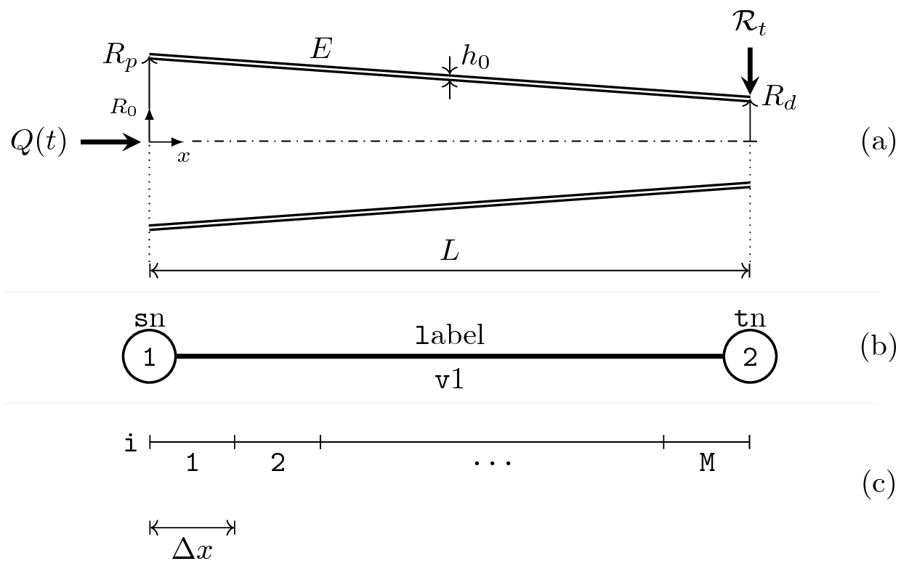

# Examples

## Single artery



```yml
project name: single-artery

blood:
  rho: 1060.0 # kg/m^3
  mu: 4.e-3   # Pa⋅s

solver:
  Ccfl: 0.9
  cycles: 100
  jump: 100
  convergence tolerance: 5.0
  
network:
  - label: v1
    sn: 1
    tn: 2

    L: 24.14e-2 # m

    Rp: 9.87e-3 # m
    Rd: 9.00e-3 # m

    E: 400.0e3 # Pa

    inlet: Q
    inlet file: inlet.dat
    inlet number: 1

    outlet: reflection
    Rt: 0.5
```

### Windkessel models

## Conjunctions

### Junction

### Bifurcation

### Anastomosis

## Multiple inlets
asds
