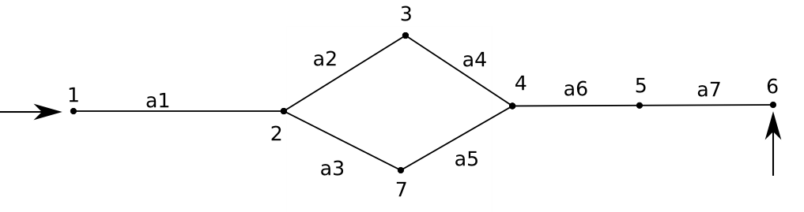
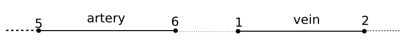
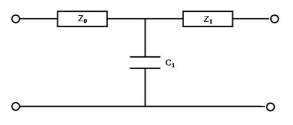
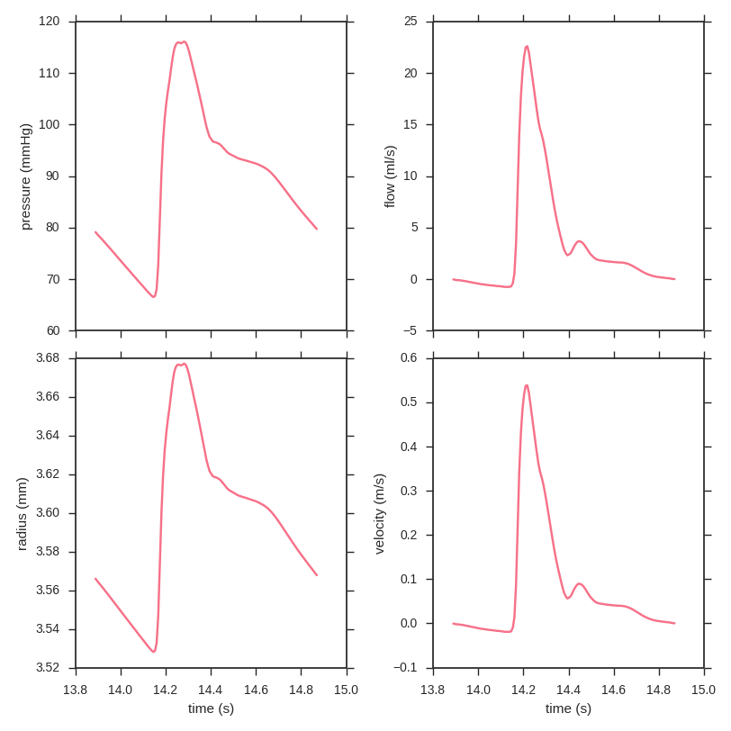

# openBF tutorial

[**openBF**](alemelis.github.io/openbf.jl) is a cardiovascular symulation library developed for research purpose at [The University of Sheffield](http://www.sheffield.ac.uk/).

## Running Julia on iceberg
The code is written in [Julia 0.3.x](http://julialang.org/downloads/oldreleases.html). Julia 0.3.13 is available in [iceberg](http://docs.iceberg.shef.ac.uk/en/latest/using-iceberg/getting-started.html#getting-started), the university HPC. Julia module can be loaded as

```
module load compilers/gcc/5.2
module load apps/gcc/5.2/julia/0.3.13
```

and an interactive session starts with the command `julia`, to exit type `exit()` or use the `ctrl+D` command.

## openBF installation

Two additional external libraries are required:

- [Graphs.jl](https://github.com/JuliaLang/Graphs.jl)
- [ProgressMeter.jl](https://github.com/timholy/ProgressMeter.jl)

These can be installed directly from a Julia interactive session (it may take few minutes) by using the commands

```
Pkg.add("Graphs")
Pkg.add("ProgressMeter")
```

In order to run a simulation, the openBF `src` folder must be in your working directory. This directory should look as

```
modelathon-folder/
        ├── src/
        ├── main.jl
        ├── sname.csv
        ├── sname-veins.csv
        ├── sname_constants.jl
        ├── sname_inlet.dat
```

## Set up a simulation

Before running a simulation, the following files must be prepared.

#### main.jl

This file contains the simulation main loop and at `line: 5`, the openBF library folder path is specified. By default this is

```
push!(LOAD_PATH, "src/")
```
but it can be changed to work in more complex directory structures.

#### sname.csv

The arterial network is described in a `comma-separated-values` file. You can open it as `gedit sname.csv &` in iceberg.

The vascular system is made of small segments connected at their ends as in the following figure


Here there are seven arteries (`a1`, ..., `a7`) defined by seven nodes. The node 1 is always the inlet node, i.e. the node from which the blood enters the system. There is only one inlet node in the system. Outlet nodes can be more than one.

With reference to the previous image, each vessel is defined by the following parameters

- `name` (type: string) is the vessel label with which the results are saved. This can be defined by the user.
- `sn` (type: integer) is the _source_ node of the vessel, e.g. `1` for `a1`.
- `tn` (type: integer) is the _terminal_ node of the vessel, e.g. `2` for `a1`.
- `wkn` (type: integer) is needed to set up the venous system inlet and it is always `0` for arteries.
- `L (m)` (type: float) is the vessel length in _meters_.
- `M` (type: integer) is the number of divisions along the vessel. This is a parameter needed to build the numerical mesh and it must be greater than `5`. A good accuracy is usually achieved by setting `dx = L/M = 1 mm`.
- `Rp (m)` (type: float) is the proximal lumen radius in _meters_, i.e. the section radius at node `1` location for `a2`.
- `Rd (m)` (type: float) is the distal lumen radius in _meters_, i.e. the section radius at node `2` location for `a1`. By setting different values for `Rp` and `Rd`, a tapered vessel is obtained. The tapering is linear along the length of the vessel.
- `E (Pa)` (type: float) is the vessel wall Young's modulus in _pascal_.
- `Pext (Pa)` (type: float) is the external pressure locally applied along the entire vessel. By default this is set to `0.` (supine position).
- `Rc (Pa m^-3)` (type: float) is the peripheral resistance to be set in the lumped parameters model of the capillary circulation (see the outlet BCs section).
- `Cc (m^3 Pa^-1)` (type: float) is the peripheral compliance of the capillary model.

#### sname-veins.csv

Veins are set as arteries. The venous network can have more than one inlet vessel. These are set by means of the `wkn` parameter.



The `wkn` is equal to the terminal node of the outlet artery to which the inlet vein is linked, e.g. for the vein above, the `.csv` may read

```
name, sn, tn, wkn, ...
vein, 1, 2, 6, ...
```

#### sname_constants.jl

This file contains global constants needed by the numerical solver. BY default it reads

```
# get inlet boundary condition time
# dependent function from _inlet.dat file
const inlet_BC_switch = 3

# inlet boundary condition
# "Q" volumetric flow rate
# "P" pressure waveform
const inlet_type = "Q"

# initial pressure to be set in all the vessels
const initial_pressure = 0.
const Ccfl   = 0.9 # Courant number to be set <= 1.

# total number of cardiac cycles to be simulated
const cycles = 15

# blood properties
const rho = 1060.   # density [kg/m3]
const mu  = 4.e-3   # dynamic viscosity [Pa⋅s]

# blood velocity radial profile
# 9: set a plug flow for large arteries
# 2: set a parabolic profile for small arteries
const gamma_profile = 9
```

#### sname_inlet.dat

It contains the inlet boundary condition waveform. This can be either a flow or pressure waveform (see `sname_constants.jl`).

```
0.000000000000000000e+00 -5.239489231023915536e-07
1.111111111111111154e-02 -1.810043543947649782e-06
2.222222222222222307e-02 -4.106752263203652509e-06
	.							.
	.							.
1.100000000000000089e+00 -5.239489231024034121e-07
```

### Outlet BCs

The arterial network allows only one kind of outlet boundary condition. This is set by means of a lumped parameter model also known as three elements windkessel [1].



Here `Z0` is the proximal peripheral resistance, `Z1` is the distal peripheral resistance, and `C1` is the peripheral compliace. These can be set individually in `sname.csv` as

```
... Pext, Z0, Z1, C1,
... 0., x, y, z,
```

or you can give openBF `Rp = Z0 + Z1` and modify the `.csv` as

```
... Pext, Rp, C1,
... 0., x, z,
```

This is because the peripheral resistance is usually reported as a unique value in the literature.

In the case of the venous system, the outlets can be either coupled with a three element windkessel or set to have a reflection coefficient `0.<=Rt<=1.` as

```
... Pext, Rt,
... 0., k,
```

`Rt` determines the amount of incoming flow to be reflected backwards in the system. A completely closed outlet has `Rt=1.` whereas a free outflow BC is set with `Rt=0.`

## Running the simulation and post-processing

Once all the simulation files are ready, from the terminal you can use the command

```
julia main.jl sname
```

where `sname` is the simulation name you used to name the setup files. This command will create a new folder `sname_results/`. Here, at the end of the simulation, you'll find, for each vessel in the network, 15 results files with the following extensions.

- `.last` files contain the last cardiac cycle simulated.
- `.out` files contain all the cardiac cycles simulated except the last one.
- `.temp` files contained intermediate results and they are emptied at the end of the simulation. In the case of error, the latest results are stored in these files.

Results files are named after the vessel name and the quantity saved (pressure `P`, flow `Q`, area `A`, pulse wave velocity `c`, and blood velocity `u`). Inside each file there are 6 columns. In the first the simulation time is reported. The remaining 5 columns contain the relative quantity at five locations along the vessel. They are the inlet, midpoint, outlet, and the two intermediate points between them.

The results can be plotted as follows to show the time dependency of the different quantities.




[1]: Alastruey J, Parker KH, Sherwin SJ. Arterial pulse wave haemodynamics. In11th International Conference on Pressure Surges 2012 Oct (pp. 401-442). Virtual PiE Led t/a BHR Group: Lisbon, Portugal.
